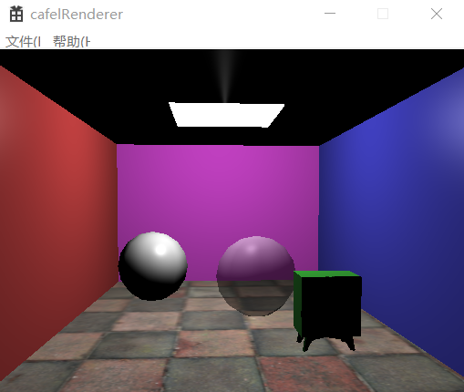
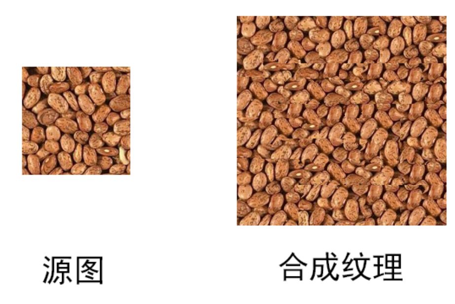
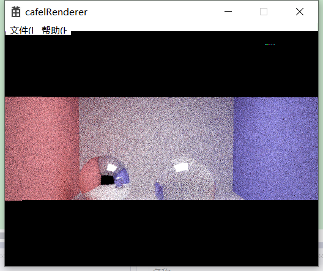

# cafelRenderer
一款基于C++的仿Mitsuba渲染器

本项目功能仿照开源渲染器Mitsuba，场景文件采用xml格式，程序读取后采用kd树组织，会首先使用glfw生成opengl场景以供预览。用户可以在场景中移动旋转相机以调整视角，找到合适位置后在菜单中点击开始渲染，渲染过程采用蒙特卡洛光路追踪，循环过程使用openmp加速。主窗口会从中间向上下两边动态的显示渲染结果，最后可以将渲染结果保存为jpg图片格式。

<b>主要功能：</b> 
&nbsp;&nbsp;&nbsp;&nbsp;&nbsp;<a href="#jump1">1.xml规划场景</a> 
&nbsp;&nbsp;&nbsp;&nbsp;&nbsp;<a href="#jump2">2.opengl预览</a> 
&nbsp;&nbsp;&nbsp;&nbsp;&nbsp;<a href="#jump3">3.内置几何体</a> 
&nbsp;&nbsp;&nbsp;&nbsp;&nbsp;<a href="#jump4">4.内置bsdf</a> 
&nbsp;&nbsp;&nbsp;&nbsp;&nbsp;<a href="#jump5">5.内置采样器</a> 
&nbsp;&nbsp;&nbsp;&nbsp;&nbsp;<a href="#jump6">6.蒙特卡洛光路追踪</a> 

 
<b>1.xml规划场景： </b><a href="#jump">返回目录</a> 
与Mitsuba相同，场景组织采用xml文件。 
在此文件中可以定义相机参数，如生成图像的宽高，追踪器采样数，光线最大深度等等。 
此外即是场景中的物体，可以通过此文件定义他们的几何信息，表面材质信息等等。 
使用tinnyxml读取xml文件，物体信息读入后，由相应的工程类生成对应对象，交由kd树进行组织和管理。 

 
<b>2.opengl预览： </b><a href="#jump">返回目录</a> 
opengl预览采用glfw，为每个相应的几何体和bsdf定义顶点和片元着色器。 
相机移动由glfw响应，WSADQE对应前后左右上下移动，ZXCV控制相机左右上下旋转镜头。 
相机移动到满意视角后即可开始渲染。 

 
<b>3.内置几何体： </b><a href="#jump">返回目录</a> 
目前支持3种内置几何体，立方体，球体，和自定义模型。 
几何体为opengl提供基于三角形面片的顶点着色器，支持纹理映射。 
自定义模型采用assimp读入，测试用模型采用obj格式。 

 
<b>4.内置bsdf： </b><a href="#jump">返回目录</a> 
目前支持3种内置bsdf，漫反射，镜面和透明。 

另外，同样支持NVIDIA的材质定义语言MDL所定义的复杂材质。 

 
<b>5.内置采样器： </b><a href="#jump">返回目录</a> 
目前支持3种内置采样器，纯色，贴图和纹理合成。 
采用纹理合成算法，输入小贴图可以合成一张大的纹理图。 

 
<b>6.蒙特卡洛光路追踪： </b><a href="#jump">返回目录</a> 
渲染流程采用蒙特卡洛光路追踪，从相机出发，每个像素采用四个亚像素，以一定采样次数进行采样，最后累积来获得该像素点的渲染结果。 
渲染流程循环次数过多，故采用C++的openmp支持来进行一定程度的加速。 
渲染结果从中间向两边动态显示。 

